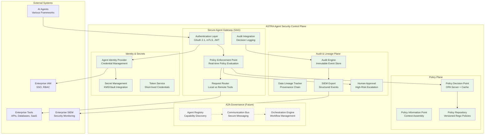
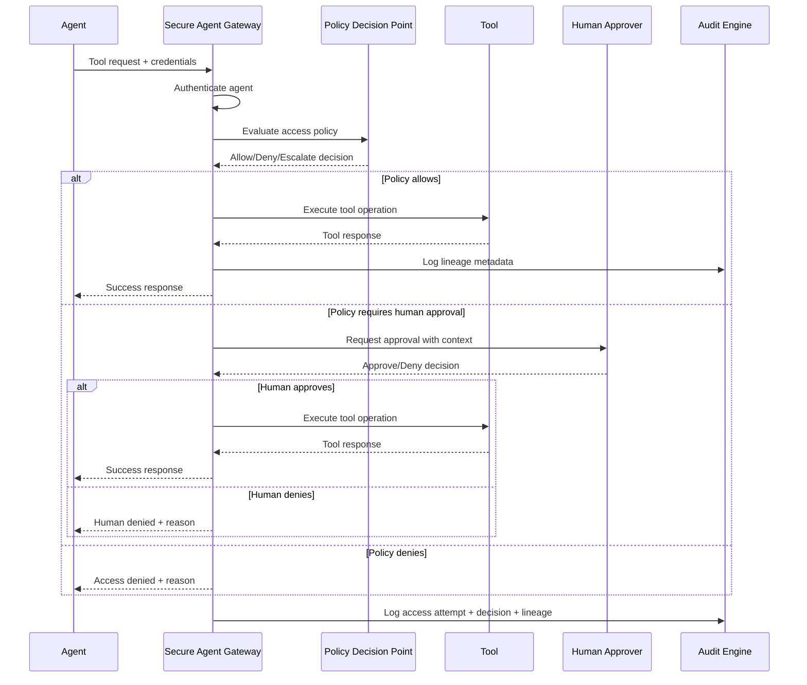
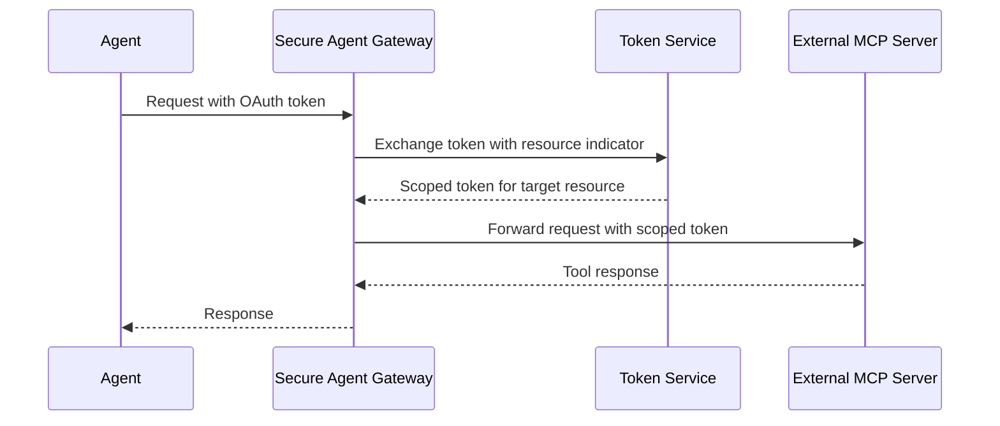

# Agent Security and Trust Reference Architecture (ASTRA) Overview

*Version 1.0 | Published: August 28, 2025*

---

## Executive Summary

The promise of agentic AI—autonomous intelligent systems that can reason, plan, and act independently—represents the next frontier in enterprise automation. Yet as organizations rush to harness this transformative technology, a dangerous chasm has emerged between AI capabilities and enterprise security infrastructure. 

ASTRA (Agent Security and Trust Reference Architecture) addresses this critical gap by providing the first comprehensive, vendor-neutral reference architecture for securing agentic AI systems. ASTRA defines an **Agent Security Control Plane** that enables secure tool access, policy-driven governance, comprehensive audit trails, and multi-agent collaboration while maintaining compatibility with existing enterprise infrastructure.

This whitepaper introduces the ASTRA framework, its core principles, architectural pillars, and interfaces. It directly addresses the security gaps identified in our comprehensive analysis of current industry limitations [[1]](#1), providing a standardized approach to implementing zero-trust security, dynamic trust management, and policy-driven governance for multi-agent AI systems.

**Key Problems ASTRA Addresses:**
- Inadequate access control mechanisms that force binary all-or-nothing privileges
- Compliance and audit gaps with insufficient immutable audit trails  
- Multi-agent coordination challenges without secure communication frameworks
- Enterprise integration barriers preventing adoption in regulated environments

---

## Scope and Non-Goals

### In Scope
- **Agent Security Control Plane**: Comprehensive framework for securing agent-to-tool and agent-to-agent interactions
- **Policy-Driven Governance**: Standardized policy evaluation and enforcement mechanisms
- **Enterprise Integration**: Seamless integration with existing IAM, SIEM, and compliance infrastructure
- **Multi-Protocol Support**: Native support for Model Control Protocol (MCP) [[11]](#11) and extensibility for other protocols
- **Regulatory Compliance**: Built-in support for SOX, GDPR, HIPAA, and other regulatory frameworks

### Non-Goals
- **Agent Development Frameworks**: ASTRA complements but does not replace agent development platforms like CrewAI, LangGraph, or AutoGen
- **Model Training Security**: Focus is on deployment-time security, not training-time protections
- **Infrastructure Security**: Assumes standard enterprise infrastructure security practices
- **Business Logic**: ASTRA provides the security layer; business logic remains in agent implementations

---

## Academic Foundation

ASTRA builds upon cutting-edge research in agentic AI security and trust management. The architecture incorporates concepts from several key academic contributions:

### Trust Fabric Concept
Drawing from Balija et al. [[2]](#2), ASTRA implements a "Trust Fabric" approach with:
- **Decentralized agent discovery** through distributed registries
- **Semantic agent cards** with verifiable credentials  
- **Dynamic trust layers** integrating behavioral attestations with policy compliance

### Comprehensive Threat Modeling
Based on Narajala & Narayan [[3]](#3) ATFAA framework, ASTRA addresses:
- **Cognitive architecture vulnerabilities**
- **Temporal persistence threats**
- **Trust boundary violations**
- **Governance circumvention**

### Zero-Trust for Agentic Systems
Implementing Huang et al. [[4]](#4) principles:
- **Trust-Adaptive Runtime Environments (TARE)**
- **Causal Chain Auditing**
- **Dynamic Identity with Behavioral Attestation**

---

## ASTRA Architectural Principles

### 1. Trust-First Design

- **Dynamic Trust Scoring**: Continuous trust evaluation based on behavior, performance, and compliance
- **Trust Delegation**: Secure capability sharing between trusted agents
- **Trust Fabric**: Interconnected trust relationships forming a resilient network

ASTRA fundamentally reimagines security for agentic systems by placing trust at the center of every interaction. Unlike traditional security models that rely on static permissions, ASTRA implements dynamic trust scoring that continuously evaluates agent behavior, performance, and compliance adherence. This approach recognizes that agent trustworthiness can change over time based on actions, environment, and context.

The architecture supports secure trust delegation, enabling high-trust agents to temporarily share capabilities with other agents within defined boundaries. This creates a trust fabric—an interconnected network of trust relationships that forms a resilient security foundation. When one agent vouches for another's capability to perform a specific task, the system can make nuanced decisions about access while maintaining strict oversight.

### 2. Zero-Trust Security

ASTRA adopts a comprehensive zero-trust approach specifically designed for agentic AI environments. Every interaction undergoes validation regardless of previous trust levels, network location, or historical access patterns. This continuous validation model recognizes that agents can be compromised, manipulated, or behave unexpectedly, requiring constant verification of intent and capability.

The system implements context-aware policy enforcement that considers not just the agent and resource, but the full environmental context including time, location, business rules, and current risk posture. Access decisions incorporate minimal privilege principles, granting only the specific permissions required for the immediate task and for the shortest time necessary to complete the operation.

### 3. Policy-Driven Governance

Governance in ASTRA is implemented through policy-as-code, treating security rules as software that can be version-controlled, tested, and systematically deployed. This approach enables organizations to maintain consistent security postures across complex multi-agent environments while supporting rapid iteration and deployment of policy changes.

Real-time policy enforcement operates at sub-second speeds, ensuring that security decisions never become bottlenecks in agent operations. The system provides automated compliance checking against regulatory frameworks, continuously validating that agent actions remain within prescribed boundaries for SOX, GDPR, HIPAA, and other regulatory requirements.

### 4. Agent Autonomy with Governance

ASTRA strikes a careful balance between enabling agent autonomy and maintaining organizational control. Agents operate independently within clearly defined policy boundaries, allowing them to make decisions and take actions without constant human intervention while ensuring compliance with enterprise security requirements.

The architecture supports collaborative intelligence between agents, enabling them to share information, coordinate activities, and learn from each other's experiences within a secure framework. For high-risk operations or when policy boundaries are approached, the system implements policy-driven escalation patterns that seamlessly integrate human oversight through approval workflows, ensuring that critical decisions receive appropriate human review while maintaining operational efficiency.

### 5. Intent Verification

- **Declared vs. Inferred Intent**: Compare what the agent says it intends to do with what the request would actually do
- **Policy-Bound Intent**: Validate intent against allowed operations, data classes, and risk posture
- **Risk-Adaptive Gating**: Escalate to human approval when intent is ambiguous, unusually risky, or deviates from norms
- **Consistency Checks**: Detect drift across sessions and tasks; flag pattern anomalies

Intent Verification operationalizes “verify, not trust” for autonomous behavior. Before executing a tool call, ASTRA extracts the agent’s declared goal from the prompt/plan, infers likely effects from the requested operation and parameters, and compares both against policy and historical behavior—grounded in intent-driven verification and assurance approaches [[15]](#15), [[17]](#17) and LLM intent formalization [[16]](#16). When alignment is high and risk is low, execution proceeds; otherwise, ASTRA triggers policy-driven guardrails such as additional context requirements, rate limits, or human approval.

---

## ASTRA Reference Architecture



---

## Core Architectural Pillars

### 1. Secure Agent Gateway (SAG)

* **Authentication and mediation**: OAuth 2.1, mTLS, JWT; token exchange not pass-through
* **Enforcement**: Serves as Policy Enforcement Point(**PEP**), evaluating policies in real time; rate limits and circuit breakers protect systems
* **Smart routing**: Local tools vs. proxied MCP servers; policy-aware dispatch

The Secure Agent Gateway forms the critical entry point for all agent-to-tool interactions, functioning as the Policy Enforcement Point (PEP) within the ASTRA architecture. This component addresses one of the most significant challenges in agentic AI security: ensuring that every tool access request is properly authenticated, authorized, and audited without introducing unacceptable latency or complexity.

The gateway implements multi-protocol authentication support, seamlessly handling OAuth 2.1 flows [8,9,10] for enterprise integration, mutual TLS for high-security environments, and JWT tokens for lightweight interactions. This flexibility ensures that ASTRA can integrate with existing enterprise authentication infrastructure while supporting the diverse authentication requirements of different agent frameworks and deployment models.

A key innovation in the SAG design is its token mediation capability, which prevents the dangerous practice of raw token forwarding. Instead of passing upstream tokens directly to downstream services, the gateway actively exchanges tokens with appropriate resource indicators and scope limitations. This approach prevents privilege escalation attacks and ensures that each service receives only the minimal access tokens required for the specific operation.

The gateway's intelligent request routing capability distinguishes between local tools that can be executed directly within the secure environment and external MCP servers that require proxied access. This routing decision considers not only the tool's location but also policy requirements, performance characteristics, and security constraints. Advanced rate limiting and circuit breaker patterns protect both individual agents and the overall system from excessive resource consumption or cascading failures.

### 2. Policy Plane

* **Real-time decisions**: OPA-backed PDP with Redis caching
* **Rich context**: Agent, tool, environment, history, and explicit intent signals
* **Policy lifecycle**: Versioned, testable policy-as-code with safe rollbacks

The Policy Plane represents the intelligence center of the ASTRA architecture, implementing the Policy Decision Point (PDP) through a sophisticated integration with Open Policy Agent (OPA) [7]. This component transforms complex organizational security requirements into real-time access decisions, enabling organizations to codify their security logic in a structured, testable, and auditable format.

The policy evaluation engine operates through rich context assembly, gathering comprehensive information about the requesting agent, target tool, environmental conditions, and historical patterns to make informed security decisions. This context-aware approach enables policies that can differentiate between a routine data query during business hours and an unusual access attempt outside normal parameters, providing the nuanced decision-making that modern agentic environments require.

Performance optimization through intelligent decision caching ensures that policy evaluation never becomes a bottleneck in agent operations. The system maintains a sophisticated cache of recent policy decisions while ensuring that cached results remain valid in the face of changing conditions, policy updates, or evolving threat landscapes.

Policy management follows software engineering best practices, treating security policies as versioned, testable code. This approach enables organizations to apply standard development lifecycle practices to their security logic, including code review processes, automated testing, staged deployments, and rollback capabilities when policy changes produce unexpected results.

**Canonical Policy Input Schema:**
```json
{
  "agent": {
    "id": "string",
    "type": "string", 
    "trust_level": "float",
    "capabilities": ["string"],
    "metadata": {}
  },
  "tool": {
    "id": "string",
    "name": "string",
    "type": "string",
    "operation": "string",
    "intended_effect": "string",
    "data_classification": "string"
  },
  "context": {
    "timestamp": "string",
    "business_hours": "boolean",
    "source_ip": "string",
    "session_age": "number",
    "declared_intent": "string",
    "inferred_intent": "string",
    "intent_confidence": "number"
  }
}
```

**Policy Packs Available:**
- **SOX Compliance Pack**: Financial reporting and internal controls
- **GDPR Compliance Pack**: Data privacy and protection requirements
- **HIPAA Compliance Pack**: Healthcare data protection standards
- **PCI-DSS Compliance Pack**: Payment card security requirements

*Note: Policy pack implementations are available through enterprise licensing.*

### 3. Audit & Data Lineage Plane
Provides comprehensive audit trails and data lineage tracking for compliance.

* **Immutable audit**: Structured, append-only event store with SIEM export
* **Lineage tracking**: Fingerprints, transformations, cross-agent correlation, temporal chains
* **Human-in-the-loop**: Approval workflows for high-risk or ambiguous intent

**Key Responsibilities:**
- **Immutable Audit Logs**: Tamper-proof record of all agent activities
- **Data Lineage Tracking**: Complete provenance chain for data transformations using content-based fingerprinting, transformation logging, and cross-agent correlation
- **PII Minimization**: Privacy-aware logging with field-level redaction
- **SIEM Integration**: Structured export to enterprise security monitoring
- **Human Escalation**: Policy-driven approval workflows for high-risk operations

**Data Lineage Mechanisms:**
- **Content Fingerprinting**: SHA-256 hashes of data inputs and outputs for tracking transformations
- **Transformation Logging**: Detailed records of agent operations, tools used, and data modifications
- **Cross-Agent Correlation**: Tracking data flow between agents using session identifiers and correlation tokens
- **Temporal Provenance**: Time-ordered chains showing complete data journey from source to destination

**Audit Event Schema:**
```json
{
  "timestamp": "2025-08-28T14:30:00Z",
  "event_type": "tool_access",
  "agent_id": "financial_analyst_001",
  "tool_name": "database_query",
  "policy_decision": true,
  "policy_reason": "Agent authorized for read access during business hours",
  "data_fingerprint": "sha256:abc123...",
  "lineage_metadata": {
    "input_fingerprints": ["sha256:def456..."],
    "transformation_type": "aggregation",
    "correlation_id": "session_789",
    "declared_intent": "summarize quarterly revenue",
    "inferred_intent": "aggregate financial metrics",
    "intent_confidence": 0.92
  },
  "human_approval_required": false,
  "audit_level": "standard"
}
```

### 4. Identity & Secrets Management
Manages agent identities and credentials with enterprise integration.

**Key Responsibilities:**
- **Agent Identity Lifecycle**: Registration, authentication, and deregistration
- **Credential Management**: Secure storage, rotation, and validation
- **Short-lived Tokens**: Dynamic token issuance with minimal scope
- **Enterprise Integration**: SSO and IAM system integration

---

## Responsibilities and Interfaces

### Policy Enforcement Point (PEP) - Secure Agent Gateway
- **Input Interface**: HTTP/HTTPS requests with MCP protocol payload
- **Authentication**: Bearer tokens, client certificates, or OAuth flows
- **Authorization**: Policy evaluation request to PDP
- **Output Interface**: Tool responses or structured denial messages

### Policy Decision Point (PDP) - Policy Plane
- **Input Interface**: Structured policy evaluation requests
- **Processing**: OPA Rego policy evaluation with context
- **Caching**: Redis-based decision caching for performance
- **Output Interface**: Allow/deny decisions with reasoning

### Policy Information Point (PIP) - Context Assembly
- **Agent Context**: Identity, capabilities, trust level, metadata
- **Tool Context**: Tool type, operation, data classification
- **Environmental Context**: Time, location, business rules
- **Intent Context**: Declared intent, inferred intent, intent confidence, historical deviations
- **Historical Context**: Previous interactions and violations

---

## Reference Data Flows

### Basic Tool Access Flow


### Token Mediation Flow


---

## Security and Privacy Principles

### Zero-Trust Implementation
- **Verify Every Request**: No implicit trust based on network location or previous access
- **Least Privilege Access**: Minimal permissions for minimal time required
- **Continuous Monitoring**: Real-time behavioral analysis and anomaly detection
- **Verify Intent**: Ensure declared and inferred intent align with policy and context

### Privacy Protection
- **PII Minimization**: Log only necessary data for security and compliance
- **Data Classification**: Automatic classification and protection of sensitive data
- **Regional Compliance**: Support for GDPR, CCPA, and other privacy regulations

### Threat Model Summary
ASTRA defends against:
- **Agent Manipulation**: Compromised or malicious agents
- **Privilege Escalation**: Unauthorized access to sensitive resources
- **Data Exfiltration**: Unauthorized data access and extraction
- **Policy Bypass**: Attempts to circumvent security policies
- **Trust Exploitation**: Abuse of trust relationships between agents

---

## Performance and Resilience Expectations

### Latency Targets
- **Policy Evaluation**: <5ms (cached), <50ms (uncached)
- **Authentication**: <100ms for OAuth flows
- **Token Exchange**: <20ms for resource-scoped tokens
- **Audit Logging**: <10ms (asynchronous)

### Availability Requirements
- **Gateway Availability**: 99.9% uptime with active-active configuration
- **Policy Service**: 99.99% availability with Redis failover
- **Audit Service**: 99.5% with asynchronous queuing tolerance

### Scalability Characteristics
- **Horizontal Scaling**: Stateless services support load balancing
- **Decision Caching**: 95%+ cache hit rate for policy decisions
- **Throughput**: 10,000+ requests/second per gateway instance

---

## Trade-offs and Alternatives

### Centralized vs. Distributed Policy
**ASTRA Choice**: Centralized Policy Decision Point with distributed enforcement
**Rationale**: Ensures consistency while enabling horizontal scaling
**Alternative**: Embedded policy engines - reduces latency but complicates policy management

### Token Mediation vs. Pass-through
**ASTRA Choice**: Active token mediation with resource indicators
**Rationale**: Prevents privilege escalation and enables fine-grained access control
**Alternative**: Token pass-through - simpler but security risk

### Synchronous vs. Asynchronous Audit
**ASTRA Choice**: Asynchronous audit with guaranteed delivery
**Rationale**: Maintains low latency while ensuring compliance
**Alternative**: Synchronous audit - stronger guarantees but higher latency

---

## Implementation Maturity Journey

ASTRA adoption follows a maturity-based progression that organizations can adapt to their specific needs, risk tolerance, and operational constraints. Timeline expectations will vary significantly based on enterprise size, regulatory requirements, and existing security infrastructure.

### Maturity Level 1: Foundational Security (2-6 months)
- Deploy Secure Agent Gateway for critical tools
- Implement basic policy evaluation with human escalation patterns
- Establish audit pipeline with immutable logging
- **Success Criteria**: 1-3 critical tools secured, policy violations detected and logged

### Maturity Level 2: Enterprise Integration (3-9 months)
- Integrate with enterprise IAM and SSO systems
- Connect to SIEM systems with structured event export
- Deploy compliance policy packs (SOX, GDPR, HIPAA)
- Implement data lineage tracking across tool interactions
- **Success Criteria**: Full enterprise authentication, regulatory audit readiness

### Maturity Level 3: Advanced Governance (6-18 months)
- Add A2A governance capabilities with secure inter-agent communication
- Implement advanced trust management and dynamic scoring
- Deploy orchestration features for complex multi-agent workflows
- **Success Criteria**: Multi-agent collaboration secured, workflow-level governance

### Dependencies
- **Canonical Policy Schema**: Must be defined before policy development
- **Token Mediation Patterns**: Required for secure external integrations
- **Audit Schema**: Needed for compliance and SIEM integration

---

## Related Work and Standards Mapping

### Academic Research Alignment
- **Trust Fabric** [2]: ASTRA implements distributed trust concepts
- **ATFAA Framework** [3]: Comprehensive threat model coverage
- **Zero-Trust Agentic Web** [4]: Runtime adaptation and causal auditing

### Industry Standards Mapping
- **OWASP GenAI Top 10** [[12]](#12): Direct mitigation mapping for agentic AI risks
- **NIST AI Risk Management Framework** [[13]](#13): Compliance with governance requirements
- **Cloud Security Alliance MAESTRO** [[14]](#14): Threat modeling framework alignment

### Vendor Ecosystem
- **Microsoft Agent Governance**: Complementary to M365/Copilot governance
- **Google Cloud AI Security**: Integration with GCP security services
- **AWS Bedrock Agents**: Compatible security layer for AWS environments

---

## Getting Started

### Open Source Implementation Guides
The ASTRA reference architecture is supported by open-source implementation guides:

- **IG-1: Getting Started**: One-command deployment with hosted playground
- **IG-2: SAG Deployment**: Production deployment with Helm charts
- **IG-3: Policy Development**: Policy pack development and testing tools

### Enterprise Support
Enterprise organizations can access:
- **Production-grade Policy Packs**: Complete compliance implementations
- **Professional Services**: Architecture assessment and deployment support
- **Managed Cloud**: Hosted ASTRA control plane with enterprise SLA

Visit [astra.unbolt.ai](https://astra.unbolt.ai) for implementation guides and community resources.

---

## Conclusion

ASTRA represents the first comprehensive reference architecture specifically designed for securing agentic AI systems in enterprise environments. By providing standardized patterns for authentication, authorization, audit, and governance, ASTRA enables organizations to safely deploy autonomous AI agents while maintaining regulatory compliance and enterprise security standards.

The architecture's modular design allows for incremental adoption, starting with core security controls and expanding to advanced multi-agent governance capabilities. This approach ensures that organizations can begin securing their agentic AI deployments immediately while building toward a comprehensive security posture.

ASTRA's vendor-neutral approach and open specification enable broad industry adoption while avoiding vendor lock-in. As the field of agentic AI continues to evolve, ASTRA provides a stable foundation for secure agent deployment that can adapt to emerging threats and capabilities.

---

## Glossary

**Agent**: An autonomous AI system capable of reasoning, planning, and taking actions to achieve goals

**Agent Security Control Plane**: The comprehensive security infrastructure governing agent interactions

**Model Control Protocol (MCP)**: Standard protocol for agent-to-tool communication [[11]](#11)

**Policy Decision Point (PDP)**: Component responsible for evaluating access policies

**Policy Enforcement Point (PEP)**: Component responsible for enforcing policy decisions

**Token Mediation**: Process of exchanging tokens to provide minimal required access

**Trust Fabric**: Network of trust relationships enabling secure agent collaboration

**Zero-Trust**: Security model requiring verification of every access request

**Intent Verification**: Process of checking declared agent intent against inferred effects, policy, and context to allow, deny, or escalate

---

## References

<a id=1 href=https://www.unbolt.ai/whitepapers/SecurityGaps> [1] Unbolt. (2025). *The Missing Trust Layer: Why Agentic AI Can't Scale Without Security and Governance*. Security Gaps Analysis Whitepaper.</a>

<a id=2 href=https://arxiv.org/abs/2507.07901>[2] Balija, S. B., Singal, R., Raskar, R., Darzi, E., Bala, R., Hardjono, T., & Huang, K. (2025). *The Trust Fabric: Decentralized Interoperability and Economic Coordination for the Agentic Web*. arXiv preprint.</a>

<a id=3 href=https://arxiv.org/abs/2504.19956>[3] Narajala, V. S., & Narayan, O. (2025). *Securing Agentic AI: A Comprehensive Threat Model and Mitigation Framework for Generative AI Agents*. arXiv preprint.</a>

<a id=4 href=https://arxiv.org/abs/2508.12259>[4] Huang, K., Mehmood, Y., Atta, H., Huang, J., Baig, M. Z., & Balija, S. B. (2025). *Fortifying the Agentic Web: A Unified Zero-Trust Architecture Against Logic-layer Threats*. arXiv preprint.</a>

<a id=5 href=https://arxiv.org/abs/2506.04133>[5] Raza, S., Sapkota, R., Karkee, M., & Emmanouilidis, C. (2025). *TRiSM for Agentic AI: A Review of Trust, Risk, and Security Management in LLM-based Agentic Multi-Agent Systems*. arXiv preprint.</a>

<a id=6>[6] Huang, K., Narajala, V. S., Yeoh, J., Raskar, R., Harkati, Y., Huang, J., Habler, I., & Hughes, C. (2025). *A Novel Zero-Trust Identity Framework for Agentic AI: Decentralized Authentication and Fine-Grained Access Control*. arXiv preprint.</a>

<a id=7 href=https://www.openpolicyagent.org/>[7] Open Policy Agent Community. (2024). *Open Policy Agent Documentation*.</a>

<a id=8 href=https://www.rfc-editor.org/rfc/rfc8707>[8] Internet Engineering Task Force. (2021). *RFC 8707: Resource Indicators for OAuth 2.0*.</a>

<a id=9 href=https://www.rfc-editor.org/rfc/rfc8414>[9] Internet Engineering Task Force. (2020). *RFC 8414: OAuth 2.0 Authorization Server Metadata*.</a>

<a id=10 href=https://www.rfc-editor.org/rfc/rfc9728>[10] Internet Engineering Task Force. (2023). *RFC 9728: OAuth 2.0 Protected Resource Metadata*.</a>

<a id=11 href=https://modelcontextprotocol.io/specification/2025-06-18/>[11] Model Control Protocol Working Group. (2024). *Model Control Protocol Specification*.</a>

<a id=12 href=https://genai.owasp.org/>[12] OWASP Foundation. (2024). *OWASP GenAI Top 10*.</a>

<a id=13 href=https://doi.org/10.6028/NIST.AI.100-1>[13] National Institute of Standards and Technology. (2023). *AI Risk Management Framework (AI RMF 1.0)*. NIST AI 100-1.</a>

<a id=14 href=https://cloudsecurityalliance.org/>[14] Cloud Security Alliance. (2025). *MAESTRO: Agentic AI Threat Modeling Framework*.</a>

<a id=15 href=https://arxiv.org/abs/2212.09944>[15] Song, Y., Zhou, W., Li, Z., et al. (2022). *Full-Life Cycle Intent-Driven Network Verification: Challenges and Approaches*. arXiv preprint.</a>

<a id=16 href=https://arxiv.org/abs/2406.09757>[16] Lahiri, S. K., et al. (2024). *Evaluating LLM-driven User-Intent Formalization for Verification-Aware Languages*. arXiv preprint.</a>

<a id=17 href=https://arxiv.org/abs/2402.00715>[17] Dzeparoska, K., et al. (2024). *Intent Assurance using LLMs guided by Intent Drift*. arXiv preprint.</a>

---

*This reference architecture document provides the conceptual foundation for implementing secure agentic AI systems. For implementation guidance, deployment configurations, and code examples, refer to the ASTRA Implementation Guide series.*

**Document Information:**
- Version: 1.0
- Published: August 28, 2025
- Next Review: November 28, 2025
- Related Documents: SecurityGaps Analysis, RA-WP2 Policy Plane, IG-1 Getting Started

---

**About ASTRA**
ASTRA is developed by Unbolt as a vendor-neutral reference architecture for the agentic AI security community. The specification and implementation guides are available under open-source licenses, with enterprise support and managed services available for production deployments.
